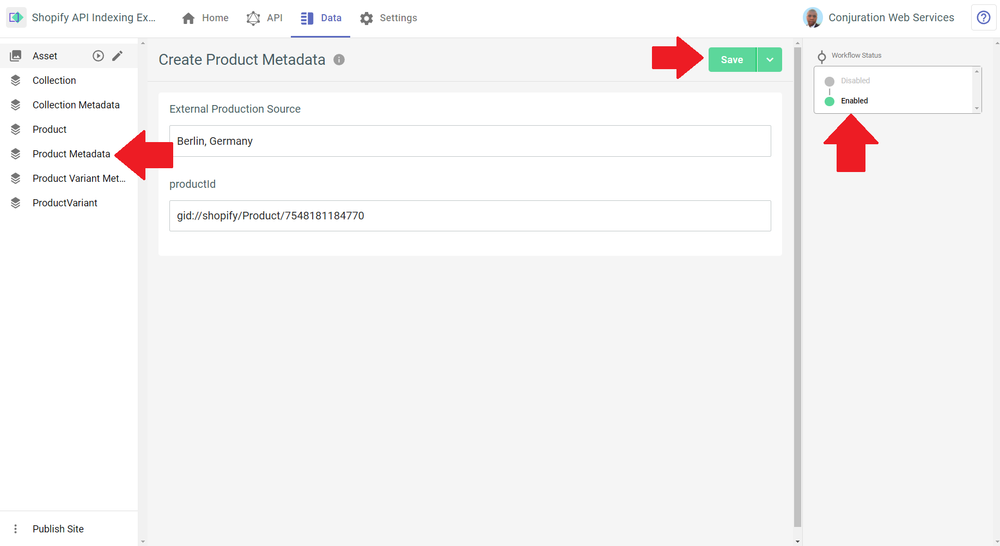

# Shopify API Indexing

Protecting yourself against API regressions or failures is simple with TakeShape's API Indexing functionality. This pattern demonstrates how you can set up your TakeShape project to leverage our API Indexing.

Check out our [Schema spec documentation](https://app.takeshape.io/docs/schema/spec#indexedshapes) to learn how to configure API Indexing in your project today.

## How to use this pattern

1. Create a TakeShape project with the pattern in this repo. The button below will deploy the project:

- 

2. Select the Setup Services button in the popup modal to connect your Shopify store to your project. In the Services section on the left side of your page, select Shopify.

3. You will be taken to the Shopify Service page. Add your Shopify shop's URL and select Save in the top-right. Select Skip when a popup modal asks you to import queries and mutations.

4. Select the Data tab, and check the Collection and Product shapes on the left side to be sure your Shopify data has been imported. If your data has not been imported, go to your Shopify service page and select "Import Data".

5. Select a CollectionMetadata or ProductMetadata shape and add an instance of one or all of them to your project. Enable it before selecting Save. Be sure to paste in a valid ID from your Shopify store. You can find the relevant ID's by selecting the relevant shape on the left side and scrolling through the list of instances. Product ID's can be found in Product, for example.

6. Wait at least 5 minutes for your new data to be indexed. You should see a message at the bottom of your browser window alerting you when API Indexing starts. You will see another message when indexing is finished. Refer to the images below for an example:

7. When indexing is done, Select the API tab and run one of the `getIndexedProductList` and `getIndexedCollectionList` queries in your API Explorer to see your indexed data.

8. You can observe the difference in your indexed data and the data in your Shopify store by making a change to a product or collection in your store. Then run one of the `getProductList` and `getCollectionList` queries from your API explorer to see how your results differ from running `getIndexedProductList` and `getIndexedCollectionList`.

9. You have now cached data with our API Indexing. Learn more about how you can extend your ecommerce data by checking out [our docs on TakeShape's data modeling](https://app.takeshape.io/docs/data/modeling). Learn how to configure your shapes from your project schema by diving into [our schema spec reference](https://app.takeshape.io/docs/schema/spec#shapes).

New to TakeShape? We combine every service you need into a single API with our API Mesh. [Check out our documentation](https://app.takeshape.io/docs/major-concepts) to learn how we can simplify your workflow.
